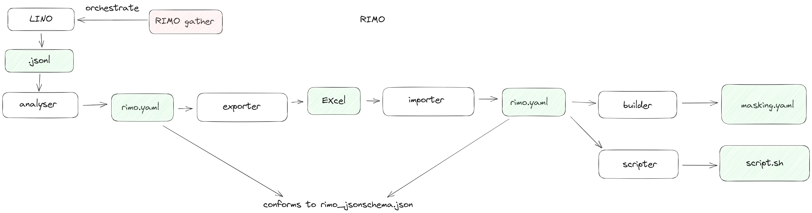

# rimo

## Description

Rimo contains tools that helps creating a *masking.yaml* for [PIMO](https://github.com/CGI-FR/PIMO).
<!-- It works as a 6 steps process : -->
<!--  -->
<!--
1. `gather` : orchestrate LINO to extract table of the database into a *.jsonl* file
2. `analyse` : extract meaningful information on database from *.jsonl*
3. `export` : dump data into an *Excel* file which serves as a configuration means
4. `import` : load, store and verify inputted data of the *Excel* file into a *.yaml* file
5. `build` : create a *pimo_masking.yaml* from *.yaml*
6. `script` : build a bash script to execute pipeline for PIMO -->

<!-- ## Installation
`rimo` command line work in relative project's directory, like `git` or `docker` -->

## Usage

### `rimo analyse`

```console
rimo analyse [inputDir] [outputDir]
```

- `inputDir` : path to a directory containing *jsonl* files.
- `output` : path to a directory where *rimo.yaml* will be created.

**inputDir** must contain .jsonl files named basename_tablename.jsonl and respecting this format :

```json
{"colName1": value1, "colName2": value2 }
{"colName1": value2, "colName2": value2 }
...
```

such files can be generated using [LINO](https://github.com/CGI-FR/LINO)

**outputDir** will generate basename.yaml in output directory containing various metrics. An example can be found in *testdata/data1/data_expected.yaml*.

## Tests

Run `neon test-int` to execute unit-test and Venom test.

## Project status

In active development

## Contributing

Pull requests are welcome. For major changes, please open an issue first to discuss what you would like to change.

## License

Copyright (C) 2023 CGI France

This file is part of RIMO.

RIMO is free software: you can redistribute it and/or modify
it under the terms of the GNU General Public License as published by
the Free Software Foundation, either version 3 of the License, or
(at your option) any later version.

RIMO is distributed in the hope that it will be useful,
but WITHOUT ANY WARRANTY; without even the implied warranty of
MERCHANTABILITY or FITNESS FOR A PARTICULAR PURPOSE.  See the
GNU General Public License for more details.

You should have received a copy of the GNU General Public License
along with RIMO.  If not, see <http://www.gnu.org/licenses/>.
